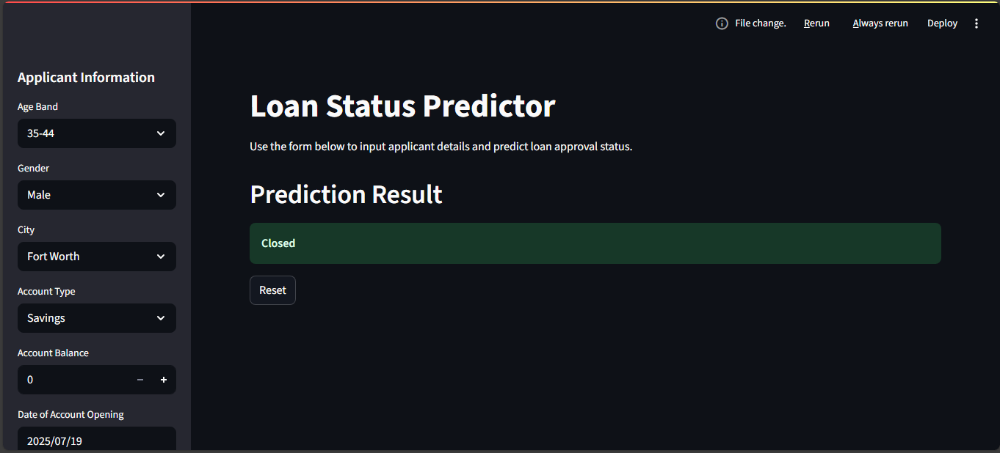

# Loan Status Prediction App

# Overview
An interactive Streamlit app that predicts loan outcomes—**Rejected**, **Approved**, or **Closed**—based on user-input features like credit score, loan amount, loan type, date of account opening, last transaction date.

## Purpose and Value

- **Faster Lending Decisions**: Replaces manual underwriting, providing instant results.
- **Consistent Outcomes**: Reduces subjective bias with uniform, data-driven logic.
- **Risk Mitigation**: Identifies high-risk applicants early to cut down defaults.
- **Operational Efficiency**: Allows underwriters to focus on edge cases, not routine submissions.

## Technical Pipeline

1. **Data Ingestion & Cleaning**  
   Load historical loan data, handle missing values, normalize numerical and encode categorical features.

2. **Feature Engineering**  
   Create strong predictors like debt-to-income ratio; remove low-information fields.

3. **Train–Test Split**  
   Use an 80/20 split to train and evaluate the model.

4. **Model Training**  
   Use Random Forest or XGBoost classifiers with hyperparameter tuning and class weighting.

5. **Evaluation**  
   Measure accuracy, precision, recall, F1-score, and inspect the confusion matrix.

6. **Deployment**  
   Serialize the trained model using `pickle` and integrate it into the Streamlit app.

7. **Inference & UI**  
   Sidebar inputs → click **Predict** → view predicted status + probabilities in real time.
   

## Running the APP
- Install dependencies
- pip install -r requirements.txt
- Launch
- streamlit run app.py
- Use sidebar to input loan features → click Predict → see status with probabilities.

Link [here](https://my-loan-status.streamlit.app/) to interact with the App 

## A view of the platform

## Challenges
- Inconsistent formats—leading to noisy signals 
- Economic patterns change over time, so past performance may not reflect future trends 

## Mitigation Strategy
- Impute or drop features that will cause noise to the data

## Future Enhancement
- Explainability: Add SHAP or feature importance visualizations.
- Monitoring & Retraining: Track data drift, schedule periodic retraining.
- Integration: Expose as an API for backend incorporation.
